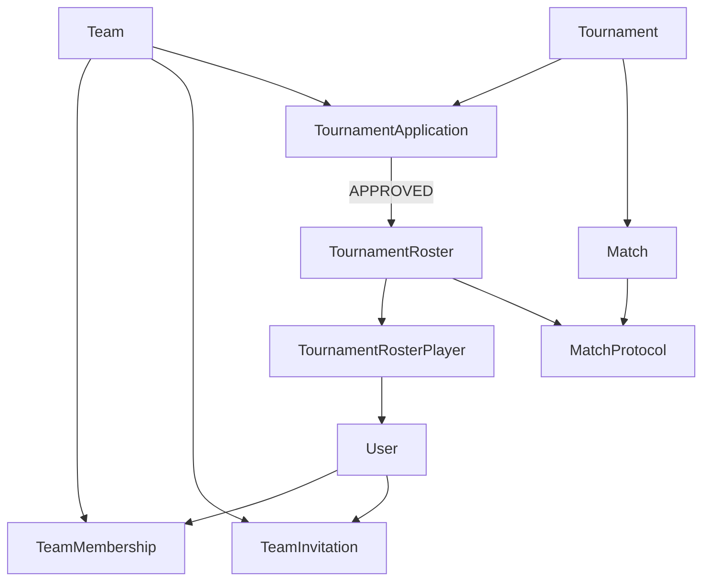
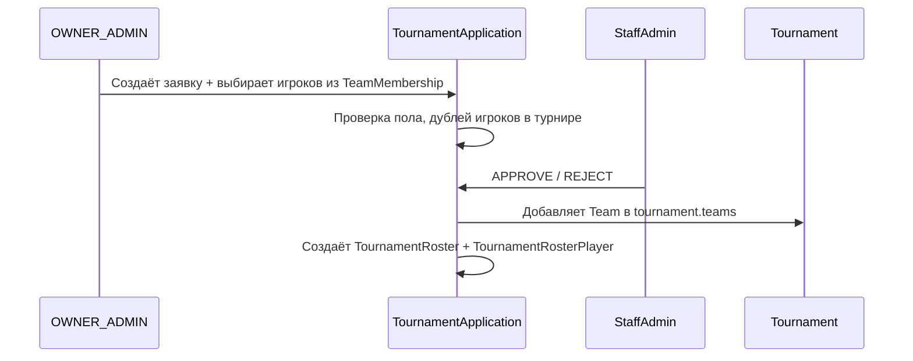

# План разработки: пользователи, команды, приглашения и заявки

## Контекст и принятые решения

**Текущее состояние:** рабочий MVP ([`volleyball/tournament/models.py`](volleyball/tournament/models.py), [`volleyball/match_protocol/`](volleyball/match_protocol/)) — турниры, матчи, протоколы, кастомная staff-админка. Отдельная модель `Player`, stock `User` только для судей/staff. **Миграции сильно отстают от моделей** — это блокер перед любыми изменениями схемы.

**Уточнения от вас:**
- Турнирный состав формирует **команда при подаче заявки** — выбирает игроков из `TeamMembership`
- Приглашения: **поиск среди пользователей + приглашение по email**
- `birth_date` и `rank` **переносятся в User** (опционально)
- Поле `max` — **контакт в мессенджере Max**

**Допущения (если не возражаете — заложим в реализацию):**
- Подтверждение email на первом этапе **не делаем** (можно добавить позже)
- Правила состава для `MIXED` — только базовая поддержка пола, без квот M/F на первом этапе (как в ТЗ: «при необходимости отдельно»)
- При блокировке команды (`BANNED`) — **техническое поражение 0:3** во всех **незавершённых** матчах команды в этом турнире; завершённые не трогаем
- Staff (`is_staff`) остаётся ролью **лиги**, отдельно от ролей в команде
- `TournamentTeamRoster` переименовываем логически в `TournamentRoster` (можно alias/rename в модели)

---

## Целевая архитектура



**Поток заявки на турнир:**



---

## Фаза 0 — Подготовка схемы БД (блокер)

**Цель:** привести миграции в соответствие с текущим кодом до введения custom User.

1. Сгенерировать недостающие мigrations для `tournament` (Player, Referee, rosters, protocol fields, SHORT format и т.д.)
2. Создать migrations для `match_protocol`
3. Прогнать `migrate` на чистой/текущей SQLite-базе
4. Зафиксировать backup [`db.sqlite3`](volleyball/db.sqlite3) перед миграцией данных

**Файлы:** [`volleyball/tournament/migrations/`](volleyball/tournament/migrations/), новая папка `match_protocol/migrations/`

---

## Фаза 1 — Приложение `accounts` и кастомный User

**Цель:** заменить stock User на `AbstractUser` с email-авторизацией.

### Модель `accounts.User`

| Поле | Примечание |
|------|------------|
| `email` | `USERNAME_FIELD`, unique |
| `password` | стандартный Django |
| `full_name` | обязательное |
| `phone` | обязательно **или** хотя бы одна соцсеть |
| `vk`, `telegram`, `max` | опциональные контакты |
| `height`, `photo` | опционально |
| `birth_date`, `rank` | перенос из Player |

### Настройки

- `AUTH_USER_MODEL = 'accounts.User'` в [`volleyball/settings.py`](volleyball/volleyball/settings.py)
- Добавить `accounts` в `INSTALLED_APPS`
- Обновить `LOGIN_URL` / redirect: публичный логин пользователя vs staff-админка

### Формы и валидация

- Регистрация: email + пароль + ФИО + (телефон **или** vk/telegram/max)
- Кастомный auth backend: login по email

### UI (минимальный каркас)

- `/accounts/register/`, `/accounts/login/`, `/accounts/logout/`
- `/accounts/profile/`, `/accounts/profile/edit/`
- `/accounts/users/` — список пользователей (публичный или для авторизованных)

### Шаблоны

- Обновить [`volleyball/tournament/templates/tournament/base.html`](volleyball/tournament/templates/tournament/base.html): блок навигации «Войти / Профиль / Мои команды»

**Структура:** `accounts/models.py`, `forms.py`, `views.py`, `urls.py`, `templates/accounts/`

---

## Фаза 2 — Команды, роли, жизненный цикл

**Цель:** расширить `Team`, добавить `TeamMembership` с комбинируемыми ролями.

### Изменения `Team` ([`tournament/models.py`](volleyball/tournament/models.py))

- Добавить: `creator` FK → User, `status` (ACTIVE/DISBANDED/BANNED), `created_at`, `ban_reason`, `banned_at`
- Добавить пол `MIXED` в `GENDER_CHOICES`
- Убрать текстовое поле `coach` (роль COACH в membership)
- Методы: `disband_if_empty()`, проверка статуса

### Модель `TeamMembership`

- `user`, `team`, `roles` (JSONField или M2M к `TeamRole` enum)
- `joined_at`, `left_at`, `is_active`
- Unique constraint: один активный membership user+team
- Валидация ролей: **один CAPTAIN** на команду; OWNER/ADMIN могут быть несколько

### Модель `TeamRole` (choices)

`OWNER`, `ADMIN`, `CAPTAIN`, `MANAGER`, `COACH`, `PLAYER`

### Сервис создания команды

При создании команды автор автоматически получает роли: OWNER + ADMIN + CAPTAIN + PLAYER.

### UI команды (публичный)

- `/teams/` — список команд
- `/teams/create/` — создание (LoginRequired)
- `/teams/<id>/` — страница команды: инфо, участники, роли, статус, история состава, турниры
- `/teams/<id>/members/` — управление участниками и ролями (OWNER/ADMIN)

**Права:** helper `team_permissions.py` или mixin — `can_invite`, `can_manage_roles`, `can_apply_to_tournament`

---

## Фаза 3 — Приглашения в команду

**Цель:** `TeamInvitation` с двумя способами приглашения.

### Модель `TeamInvitation`

- `team`, `invited_user` (nullable — для email-приглашений), `invited_email` (nullable)
- `invited_by`, `status` (PENDING/ACCEPTED/REJECTED/CANCELLED)
- `created_at`, `processed_at`
- Token для email-ссылки (uuid)

### Логика

1. **Поиск пользователя** — OWNER/ADMIN находит User, отправляет приглашение → уведомление в UI
2. **По email** — если User существует, привязать; если нет — при регистрации/логине по ссылке принять приглашение
3. **Accept** → создать/реактивировать `TeamMembership` с ролью PLAYER (роли можно изменить позже)
4. **Reject / Cancel** — смена статуса

### UI

- `/teams/<id>/invitations/` — список, отправка
- `/invitations/` — входящие приглашения пользователя
- `/invitations/<token>/accept/` — по email-ссылке

**Email:** на первом этапе — console backend для dev; структура под SMTP готова в settings.

---

## Фаза 4 — Заявки на турнир и турнирный состав

**Цель:** заменить ручное добавление команд staff-ом на workflow заявок.

### Модель `TournamentApplication`

- `tournament`, `team`, `created_by`, `status` (PENDING/APPROVED/REJECTED)
- `created_at`, `processed_at`, `processed_by`, `comment`
- M2M или inline через промежуточную модель `TournamentApplicationPlayer(user)` — **выбранный состав при подаче**

### Правила при подаче заявки

- Только OWNER или ADMIN команды
- Команда `ACTIVE`, пол совместим с турниром (M/F exact; MIXED — отдельные правила позже)
- Каждый выбранный игрок — активный `TeamMembership`
- **Один User — одна команда в турнире:** проверка при выборе игроков (уже есть аналог в [`admin_views.py:1077`](volleyball/tournament/admin_views.py) для Player)
- Минимум 1 игрок в заявке (уточним при реализации)

### При одобрении (staff)

1. `team` добавляется в `tournament.teams`
2. Создаётся `TournamentRoster` (бывш. `TournamentTeamRoster`)
3. Создаются `TournamentRosterPlayer` → FK на `User` вместо `Player`
4. Заявка → APPROVED

### При отклонении

- Статус REJECTED + comment, roster не создаётся

### Обновление gender-валидации

- [`Match.clean()`](volleyball/tournament/models.py), `TournamentTeamRoster.clean()` — поддержка MIXED (M/F турнир ↔ M/F/MIXED команда по согласованным правилам)

### UI

- `/tournaments/` — список турниров (публичный)
- `/tournaments/<id>/apply/` — форма заявки с чекбоксами участников команды
- `/teams/<id>/applications/` — заявки команды

---

## Фаза 5 — Миграция данных Player → User

**Цель:** сохранить все исторические данные.

### Data migration (упорядоченно)

1. Создать `accounts.User` из каждого `Player` (email: `player{id}@migrate.local` или из staff-справочника — **потребует ручной доработки email для реальных игроков**)
2. Перенести `birth_date`, `rank`, `full_name`
3. Обновить `TournamentRosterPlayer.player` → `user` (FK rename)
4. Мигрировать `Referee.user` на новую модель User (OneToOne сохраняется)
5. Для существующих `Team` без creator — назначить системного/staff user или первого игрока состава
6. Удалить модель `Player` (после переключения всех FK)

### Обновить зависимости

- [`match_protocol/models.py`](volleyball/match_protocol/models.py) — `MatchSquadPlayer.roster_player` уже ссылается на `TournamentRosterPlayer`
- [`match_protocol/services.py`](volleyball/match_protocol/services.py) — заменить обращения к `player.full_name` на `user.full_name`
- [`populate_test_data.py`](volleyball/tournament/management/commands/populate_test_data.py) — переписать под User/TeamMembership

---

## Фаза 6 — Staff-админка (расширение)

**Цель:** обработка заявок, блокировки, управление составами — в существующей панели [`admin_views.py`](volleyball/tournament/admin_views.py).

### Новые разделы `/admin-panel/`

| Раздел | Действия |
|--------|----------|
| Пользователи | список, просмотр, блокировка аккаунта |
| Заявки на турнир | очередь PENDING, approve/reject |
| Команды | блокировка BANNED → тех. поражения в матчах |
| Составы | просмотр/редактирование TournamentRoster (override) |

### Рефакторинг существующих CRUD

- Убрать CRUD `Player` → перенаправить на User management
- Teams: не удалять физически; статусы DISBANDED/BANNED
- Rosters: выбор из User вместо Player
- Referees: создание через accounts.User

### Блокировка команды

```python
# services/team_ban.py (новый)
# для каждого незавершённого Match команды в турнире:
#   sets: 0:3 или 3:0, is_finished=True, пометка "technical_defeat"
```

---

## Фаза 7 — Полировка UI и интеграция

- Единый стиль с существующими шаблонами (inline CSS в base.html)
- Страница команды: вкладки «Участники», «Приглашения», «Турниры», «История»
- Flash-сообщения для всех действий (паттерн уже есть в admin_views)
- Обновить навигацию burger-menu в base.html
- Redirect судей: login через accounts, проверка `Referee.is_active`

---

## Фаза 8 — Тесты и регрессия

Минимальный набор (ручной + unit):

- Регистрация с валидацией контактов
- Создание команды + auto-roles
- Приглашение (user + email flow)
- Заявка с дублем игрока в турнире → ошибка
- Approve заявки → roster + tournament.teams
- Протокол матча с новым User-based roster
- Турнирная таблица и расписание без регрессий
- Ban команды → тех. поражения

---

## Порядок веток / итераций

| Итерация | Результат | Можно деплоить |
|----------|-----------|----------------|
| 0 | Мigrations sync | Да |
| 1 | accounts + регистрация/логин/профиль | Да (параллельно со старым Player) |
| 2–3 | Команды + приглашения | Да |
| 4 | Заявки + roster selection | Да (staff approve) |
| 5 | Data migration Player→User | **Критическая точка** |
| 6–7 | Admin + UI polish | Да |
| 8 | Тесты | — |

**Критическая точка:** Фаза 5 — после неё `Player` удалён, все FK на User. До этого можно разрабатывать параллельно, но не удалять Player.

---

## Ключевые файлы для изменений

| Область | Файлы |
|---------|-------|
| User/auth | новый `accounts/*`, `settings.py`, `volleyball/urls.py` |
| Domain models | `tournament/models.py` |
| Business logic | новый `tournament/services/` (applications, invitations, team_ban) |
| Public views | новый `tournament/team_views.py`, `tournament/application_views.py` или views в accounts |
| Admin | `tournament/admin_views.py`, шаблоны `templates/tournament/admin/` |
| Protocol | `match_protocol/services.py`, `match_protocol/models.py` |
| Templates | `base.html`, новые `accounts/`, `teams/`, `invitations/` |
| Migrations | `accounts/migrations/`, data migrations в `tournament/` |

---

## Риски и как их снимаем

1. **Custom User + существующие Referee/staff** — миграция auth_user → accounts_user через Django swappable model migration; backup БД обязателен
2. **Email у Player отсутствует** — временные email при миграции + UI «укажите email» для legacy-пользователей
3. **Tournament.teams M2M** — сохраняем как источник истины для матчей; заявки только gateway в этот M2M
4. **Исторические составы** — TournamentRoster не пересчитывается при изменении TeamMembership (immutable snapshot при approve)
